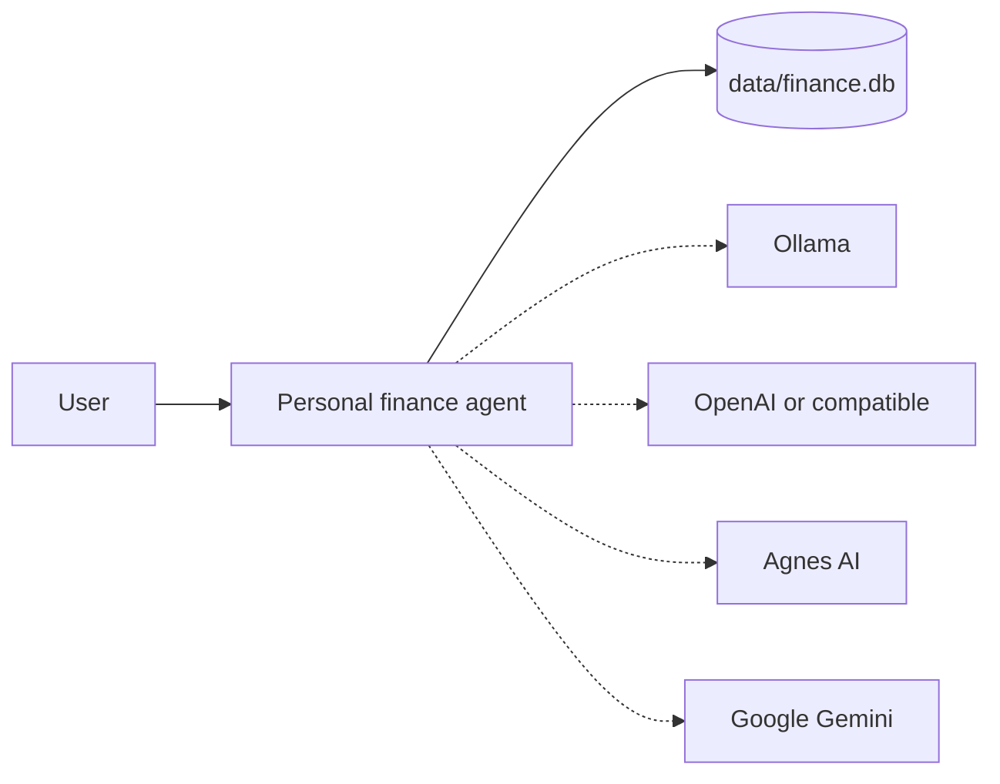
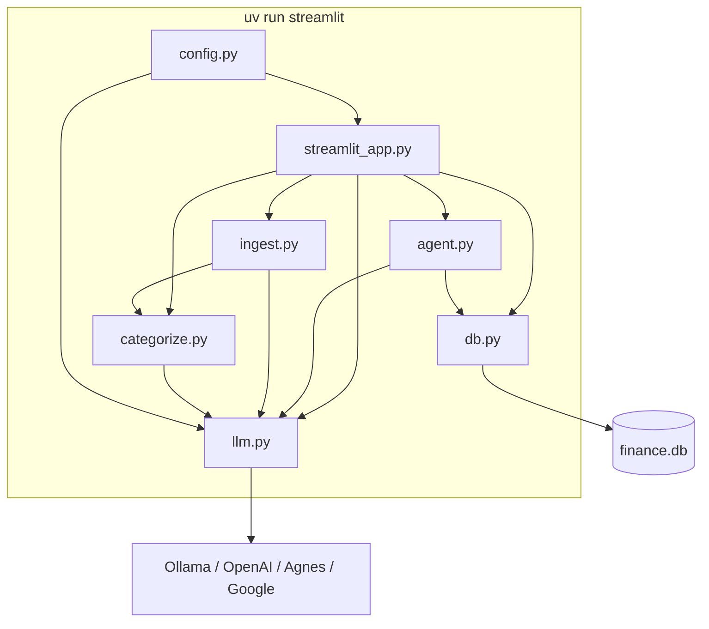
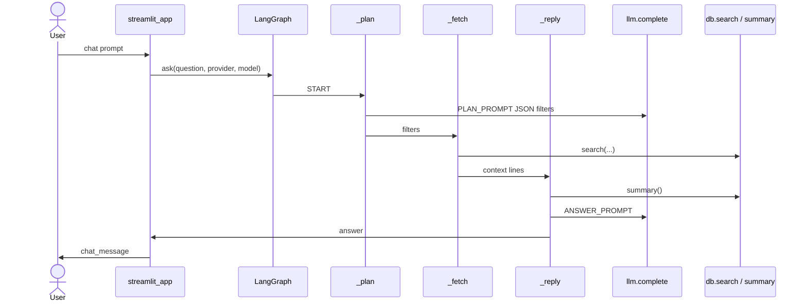
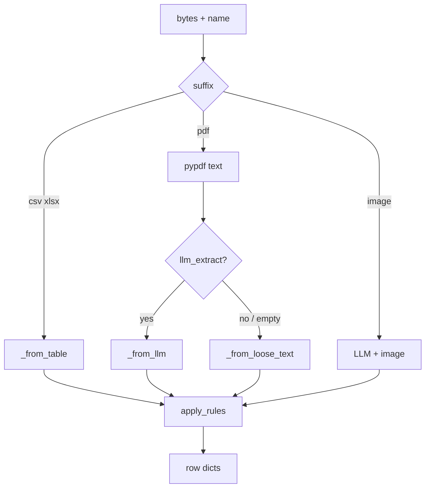

# Architecture — Personal finance agent

Local-first snapshot of the checkout on disk. Not a product pitch.

**Identity.** Branch `master`. No commits (`git log` fails: no HEAD). No `git remote`. Version `0.1.0` (`pyproject.toml` L2). No license file.

---

## Part 1 — Whole-repo technical deep-dive

### What this is

Phase 1 local Streamlit app: upload statements, store transactions in SQLite, categorize them, ask questions in chat (`README.md` L1–5; `pyproject.toml` L4). Eight Python files. One package: `finance-agent`.

### Tech stack

| Layer | Technology | Evidence |
| --- | --- | --- |
| Language | Python `>=3.11` (local bytecode is 3.14) | `pyproject.toml` L9; `.python-version` L1; `src/finance_agent/__pycache__/*.cpython-314.pyc` |
| App UI | Streamlit `>=1.61.1` | `pyproject.toml` L20; `streamlit_app.py` L1, L10 |
| Agent graph | LangGraph `>=1.2.11` | `pyproject.toml` L13; `src/finance_agent/agent.py` L8, L90–100 |
| LLM | OpenAI SDK, Google GenAI, Ollama via OpenAI-compat | `src/finance_agent/llm.py` L7–8, L78–80, L83–96 |
| Tables | pandas, openpyxl | `pyproject.toml` L15–16; `src/finance_agent/ingest.py` L12, L35–37 |
| PDF / images | pypdf, Pillow | `pyproject.toml` L17–18; `src/finance_agent/ingest.py` L13, L38–47 |
| Storage | SQLite (`sqlite3`) at `data/finance.db` | `src/finance_agent/db.py` L5, L29–34; `src/finance_agent/config.py` L13–14 |
| Config | python-dotenv, env vars | `src/finance_agent/config.py` L8–10, L44–45 |
| HTTP | httpx (Ollama tags) | `src/finance_agent/llm.py` L21–28 |
| Package / lock | uv, `uv_build`, `uv.lock` | `pyproject.toml` L23–25; `uv.lock` present |
| Lint / types / test | ruff, ty, pytest | `pyproject.toml` L28–32, L34–63 |

**[Resolved contradiction]** Runtime pin vs tool pin:

- `.python-version` is `3.14`.
- `requires-python` is `>=3.11` (`pyproject.toml` L9).
- ruff `target-version = "py311"` (`pyproject.toml` L36).
- ty `python-version = "3.11"` (`pyproject.toml` L63).
- Compiled files in `__pycache__` are `cpython-314`.

Floor is 3.11. This checkout runs 3.14. Lint/types still check as 3.11.

### Entry points

| Kind | Path | What it does |
| --- | --- | --- |
| UI | `streamlit_app.py` | Sidebar model + upload, metrics, Chat / Transactions tabs |
| Windows launcher | `run.cmd` | Installs uv if missing, copies `.env`, `uv sync --all-groups`, `streamlit run` (`run.cmd` L5–28) |
| Library | `src/finance_agent/` | Ingest, categorize, db, LLM, LangGraph Q&A |
| Tests | `tests/test_phase1.py` | 3 tests: rules, CSV debit/credit, JSON fence |

No HTTP API, no CLI besides Streamlit, no `pages/` / `app_pages/`.

### Commands & Verification Inventory

No Makefile, no `just`, no tox/nox, no CI workflows (no `.github/`). Commands taken from `README.md`, `run.cmd`, and `pyproject.toml`. Ran the three tool commands in this checkout.

| Command | Purpose | Evidence | Ran here |
| --- | --- | --- | --- |
| `uv sync --all-groups` | Install runtime + dev groups | `run.cmd` L21; `README.md` | not re-run this pass |
| `uv run streamlit run streamlit_app.py` | Serve UI | `README.md`; `run.cmd` L28 (`--server.headless true`) | not launched (5 min cap; not needed for this doc) |
| `uv run pytest` | All tests | `README.md`; `pyproject.toml` L29 | **3 passed** in 1.33s |
| `uv run pytest tests/test_phase1.py::test_csv_debit_credit` | Single test | pytest default; no custom `[tool.pytest]` | `[UNVERIFIED]` this exact invocation |
| `uv run ruff check` | Lint | `pyproject.toml` L29, L34–56 | `--help` exists |
| `uv run ruff format` | Format | ruff is the formatter; no Makefile target | `[UNVERIFIED]` as a project-documented command |
| `uv run ty check` | Typecheck | `pyproject.toml` L30, L62–63 | `--help` exists |
| `uv build` | Build sdist/wheel | `pyproject.toml` L23–25 (`uv_build`) | `[UNVERIFIED]` |
| CI | none on disk | no `.github/workflows` | n/a |
| CI enforced (branch protection) | `[UNVERIFIED]` | no remote | n/a |

No e2e, contract, or smoke-test command on disk.

### Directory layout

| Path | Purpose |
| --- | --- |
| `streamlit_app.py` | Entire UI |
| `src/finance_agent/` | Package (6 modules + `__init__.py`) |
| `tests/` | One test file |
| `.streamlit/config.toml` | Theme + `gatherUsageStats = false` |
| `.env.example` | Key names |
| `data/` | Runtime SQLite; gitignored (`.gitignore` L14) |
| `run.cmd` | Windows start |
| `uv.lock` | Locked deps |
| `ARCHITECTURE.md` | This file |

### Deployment & Runtime Surface

Local-only. No Dockerfile, compose, serverless, or CI runner image.

| Pin | Value | Evidence |
| --- | --- | --- |
| Python (declared) | `>=3.11` | `pyproject.toml` L9 |
| Python (local pin file) | `3.14` | `.python-version` L1 |
| Python (tools) | `3.11` | `pyproject.toml` L36, L63 |
| App process | `uv run streamlit run streamlit_app.py` | `README.md`; `run.cmd` L28 |
| Data store | file SQLite `data/finance.db` | `src/finance_agent/config.py` L13–14 |
| Ollama host | `http://localhost:11434` default | `src/finance_agent/config.py` L26; `.env.example` L13–14 |

**Drift:** build/tool target 3.11 vs local run 3.14. No container pin to drift against.

### EOL / dead-dependency scan

Nothing on disk is a dead stack. `[INFERRED]` / `[UNVERIFIED]` only:

| Item | Note |
| --- | --- |
| Python 3.11+ / 3.14 | Supported. Not EOL. |
| Streamlit 1.61, LangGraph 1.2, pandas 3, openai 3 | Current majors in the lock/manifest. Not abandoned. |
| Model names `gpt-5.6-*`, `gemini-3.*`, `agnes-2.5-flash` | Hardcoded in `src/finance_agent/config.py` L18–24. Availability `[UNVERIFIED]` off-disk. |
| `update_category` | Defined, never called (`src/finance_agent/db.py` L133–135). Dead API, not a dead dep. |

### Data / storage

One table `transactions` (`src/finance_agent/db.py` L12–26):

`id`, `date`, `description`, `amount`, `currency` default `INR`, `category` default `OTHER`, `source_file`, `account`, `created_at`.

Indexes on `date` and `category` (L24–25). Dedup key: `date` + `description` + `amount` (L42–51). `summary()` treats `amount < 0` as spent, `> 0` as income (L119–130). `search()` filters start/end/category/text, limit clamped 1–200 (L87–113).

Created on connect; `DATA_DIR.mkdir` (`db.py` L29–34). No migrations, no ORM.

### APIs, jobs, plugins, CI

No public HTTP API. LLM calls are outbound only (`llm.py`). No background jobs. No plugin loader. No CI.

### Testing

`tests/test_phase1.py` — 3 tests, no fixtures, no coverage floor (no `[tool.pytest]`, no pytest-cov). Covers `apply_rules`, CSV debit/credit parse, fenced JSON. Does not cover PDF, images, SQLite, LangGraph, or providers.

---

## Part 2 — Context & ecosystem

### Checkout identity

| Field | Value |
| --- | --- |
| Remote | none |
| Branch | `master` (no commits) |
| HEAD | none |
| Package | `finance-agent` `0.1.0` |
| License | none on disk |
| Author | Ahmad Mujtaba (`pyproject.toml` L6–8) |

### Agent / contributor docs

None of `AGENTS.md`, `CONTRIBUTING`, `.github/copilot-instructions.md`, `CODEOWNERS`. Rules that exist:

- README: how to run, models, local data (`README.md`).
- `.gitignore`: `.env`, `data/`, `.venv`, `.streamlit/secrets.toml`.
- ruff `select = ["ALL"]` with an explicit ignore list (`pyproject.toml` L39–56).

### Developer gotchas

1. CSV/Excel work with no model; PDF, images, leftover LLM cats, and chat need a selected model + key (`README.md`; `streamlit_app.py` L43–47 vs L63–67, L113–115).
2. Ollama model list is a live `GET {OLLAMA_HOST}/api/tags` with 2s timeout (`llm.py` L21–28). Empty list → sidebar warning (`streamlit_app.py` L19–21).
3. `data/` and `.env` are local-only (`.gitignore` L13–15).
4. Category dropdown in the table does not persist: UI uses `st.dataframe` + `SelectboxColumn` (`streamlit_app.py` L129–141) but never calls `update_category`.
5. After ingest adds rows, the app `st.rerun()`s (`streamlit_app.py` L74–75).
6. Python 3.14 local vs 3.11 tool target — see contradiction above.

### Ecosystem (on disk only)

Standalone app. Optional outbound: Ollama, OpenAI (`OPENAI_BASE_URL` optional), Agnes `https://apihub.agnes-ai.com/v1` (`config.py` L22), Google Gemini. No sibling services in this tree.

---

## Part 3 — Architectural blueprint

### Shape

Single-process modular monolith. Streamlit process owns UI + library calls. SQLite file is the only store. LLMs are stateless HTTP.

### C4 — Level 1 context

### C4 — Level 2 containers

Layering is import convention only. Nothing enforces it (no import-linter, no layers in ruff).

**Allowed [INFERRED]:** UI → package; `agent` → `db` + `llm` + `ingest.parse_json_payload`; `ingest` → `categorize`; all → `config`.

**Avoid [INFERRED]:** `db` / `config` importing Streamlit or LLM.

### C4 — Level 3 request lifecycle (chat)

Graph wiring: START → plan → fetch → reply → END (`agent.py` L90–100). Compiled graph cached `@lru_cache(maxsize=1)` (L90–91).

### Cross-cutting concerns

| Concern | Where | Evidence |
| --- | --- | --- |
| Auth | None in-app | no login code |
| Secrets | Environment only | `config.py` L1, L8–10, L44–45; `.env.example`; `missing_key()` `llm.py` L43–50 |
| Config | Module constants + env | `config.py` L16–41 |
| Logging | None | no logging setup |
| Metrics / tracing | Streamlit metrics from `summary()` only | `streamlit_app.py` L41–45 |
| Errors | Per-file try/except in ingest UI; LLM JSON fallback to `{}` | `streamlit_app.py` L61–72; `agent.py` L45–50 |
| Feature flags | One checkbox: LLM leftover cats | `streamlit_app.py` L35, L63 |
| Theme | `.streamlit/config.toml` | L1–8 |

### Inferred ADRs (from code + README)

1. **Local SQLite, not a bank API.** Ledger is a file. No Plaid/etc.
2. **Rules first, LLM second.** `apply_rules` always; `categorize_with_llm` only on `OTHER` (`categorize.py` L31–42).
3. **Expenses negative.** Table parser and PDF fallback (`ingest.py` L139–141, L174).
4. **INR default.** `config`/`db`/`ingest`.
5. **Dedup on natural key**, not file hash (`db.py` L42–51). Re-upload same rows is a no-op.
6. **Four providers, one `complete()`.** OpenAI-compat for OpenAI/Agnes/Ollama; Google separate (`llm.py` L53–80).
7. **Answers only from fetched rows.** `ANSWER_PROMPT` (`agent.py` L22–27).
8. **No Streamlit secrets.toml in git.** Ignored (`.gitignore` L15). Keys via `.env`.

### Governance

No CI, CODEOWNERS, or review bots. Enforcement is ruff/ty/pytest when someone runs them, plus `.gitignore` for secrets/data.

### How to add a feature

1. Domain logic in `src/finance_agent/`, not in `streamlit_app.py`.
2. New category: add to `CATEGORIES` (`config.py` L28–41) and a rule tuple (`categorize.py` L9–21). Update the table `SelectboxColumn` options (they read `CATEGORIES`).
3. New file type: branch in `parse_file` (`ingest.py` L32–50).
4. New provider: `PROVIDERS` + `models_for` / `missing_key` / `complete` (`config.py`, `llm.py`).
5. New question behavior: change `PLAN_PROMPT` / `search()` filters (`agent.py`, `db.py`).
6. Add a test in `tests/test_phase1.py` or a new `tests/test_*.py`.
7. Run `uv run pytest` then `uv run ruff check`.

**Pitfalls**

- Table edits do not save.
- Chat and PDF ingest fail closed if model/key missing (`streamlit_app.py` L113–115).
- Dedup can drop a legitimate second tx with the same date/description/amount.
- Image extract always sends `mime_type="image/png"` (`llm.py` L130) even for jpeg/webp.
- `account` column exists but ingest never sets it (`db.py` L21; `ingest.py` rows have no `account`).

---

## Subsystem deep-dives

### 1. Ingest pipeline

`parse_file(name, data, llm_extract=None)` (`ingest.py` L32–54).

| Suffix | Path |
| --- | --- |
| `.csv` / `.tsv` | `pd.read_csv` → `_from_table` |
| `.xlsx` / `.xls` | `pd.read_excel` → `_from_table` |
| `.pdf` | pypdf text → LLM JSON if callback, else `_from_loose_text` |
| `.png` `.jpg` `.jpeg` `.webp` | LLM + image bytes; no model → `ValueError` |

`_from_table` maps fuzzy column names (`DATE_COLS`, `DESC_COLS`, debit/credit vs single amount). Debit → negative, credit → positive (L136–141). Every row then gets `source_file` and `apply_rules(description)` (L51–53).

LLM extract: prompt + first 12k chars (`ingest.py` L192–193). JSON via `parse_json_payload` (strips fences, slices first `[...]` or `{...}`) (L178–189). Amount/currency/category validated; unknown category → `OTHER` (L201–217).

UI wraps this in `st.status`, optional `categorize_with_llm`, `insert_many` (`streamlit_app.py` L47–75).

### 2. Categorize

`RULES`: needle tuples → category (`categorize.py` L9–21). First match wins. No match → `OTHER` (L31–36).

`categorize_with_llm` only sends `OTHER` rows, indexed `id` 0..n-1 (L39–45). Expects JSON `[{"id", "category"}]`. Invalid / unknown cats ignored (L50–64).

### 3. LangGraph Q&A

State: `question`, `provider`, `model`, `filters`, `context`, `answer` (`agent.py` L30–36).

- `_plan`: LLM returns JSON filters; category must be in `CATEGORIES` else `None`; bad JSON → empty filters (L39–66).
- `_fetch`: `search(**filters)` → `"date | category | amount currency | description"` lines, or `(none)` (L69–74).
- `_reply`: `summary()` + context into `ANSWER_PROMPT` (L77–87).

`ask()` is the only public entry (`agent.py` L103–114).

### 4. LLM wrapper

`complete(provider, model, prompt, system=, image=)` (`llm.py` L53–80).

- Google → `google.genai` (`_google`, L109–135).
- Else OpenAI client (`_openai_compat`, L83–106):
  - OpenAI: key + optional `OPENAI_BASE_URL`, `reasoning_effort=medium`; retry without that kwarg on exception (L84–105).
  - Agnes: `AGNES_API_KEY` + fixed base URL.
  - Ollama: dummy key `ollama`, `{OLLAMA_HOST}/v1`.

Images become a data-URL part (L64–74). Google decodes that URL back to bytes as PNG (L127–131).

---

## Confidence

| Area | Rating | Why |
| --- | --- | --- |
| Module layout, ingest, db, agent graph | High | Files read; line cites |
| Commands: pytest | High | 3 passed this pass |
| ruff / ty as installed tools | High | `--help` ran |
| `ruff format` / `uv build` / single-test path | Unverified | Not executed / not documented |
| Streamlit run | Unverified | Not launched this pass |
| CI / branch protection | Unverified | No remote, no workflows |
| Model IDs still valid at providers | Unverified | Off-disk |
| Layering rules | Inferred | Imports only; no enforcer |
| `update_category` unused | High | Single definition, no callers |
| Python 3.11 vs 3.14 pin | High | Manifest vs `.python-version` vs pyc |

---

## Modernization verdict

This is not a legacy system. Stack is already uv + `src/` + ruff + ty + pytest + lockfile.

**Do not write `MODERNIZATION_PLAN.md` for this checkout.** A safety-laddered rewrite plan would be inventory theater.

Leave-alone except three small, optional nits (not a migration):

1. Align `.python-version` with ruff/ty (3.11 vs 3.14).
2. Wire `update_category` or drop the fake-editable column.
3. Add CI only if this gets a remote and you want a gate.

CI Milestone: none today. First lit test command already exists: `uv run pytest`. Enforcement (branch protection) is a human GitHub setting; there is no remote yet.

---

## Footnotes — files used

| File | Establishes |
| --- | --- |
| `README.md` | Product sentence, run commands, model table |
| `pyproject.toml` | Name, version, deps, tools, Python floor |
| `.python-version` | Local 3.14 pin |
| `uv.lock` | Lockfile present |
| `run.cmd` | Windows bootstrap + headless Streamlit |
| `.env.example` | Secret names |
| `.gitignore` | `.env` / `data/` / secrets.toml |
| `.streamlit/config.toml` | Theme, no usage stats |
| `streamlit_app.py` | UI flow |
| `src/finance_agent/config.py` | Paths, providers, categories |
| `src/finance_agent/db.py` | Schema, dedup, search, summary |
| `src/finance_agent/ingest.py` | Parse matrix |
| `src/finance_agent/categorize.py` | Rules + leftover LLM |
| `src/finance_agent/agent.py` | LangGraph plan/fetch/reply |
| `src/finance_agent/llm.py` | Provider I/O |
| `tests/test_phase1.py` | What is actually tested |
