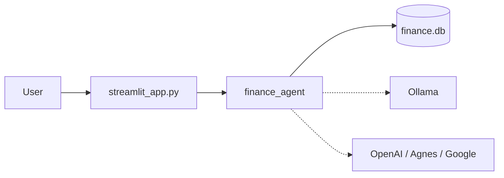

# Architecture: personal finance agent

Local-first snapshot of the checkout. Claims below are from files on disk.

**Identity.** Remote `https://github.com/pypi-ahmad/intelligent-personal-finance-agent.git`. Branch `main`. HEAD `0109ff3`. Package `finance-agent` `0.1.0` (`pyproject.toml` L1-3). MIT license (`LICENSE`).

---

## Part 1: whole-repo technical deep dive

Phase 8 Streamlit copilot: ingest statements, learn category fixes, dashboard, inbox, optional Fernet lock (`README.md`; `src/finance_agent/__init__.py` L1). Package lives in `src/finance_agent/` (14 modules). UI is one file: `streamlit_app.py`.

### Tech stack

| Layer | Technology | Evidence |
| --- | --- | --- |
| Language | Python `>=3.11` | `pyproject.toml` L9 |
| UI | Streamlit `>=1.61.1` | `pyproject.toml`; `streamlit_app.py` `st.set_page_config` |
| Agent | LangGraph `>=1.2.11` | `pyproject.toml`; `agent.py` |
| LLM | openai, google-genai, Ollama tags via httpx | `llm.py` |
| Parse | pandas, openpyxl, pypdf, Pillow | `ingest.py` |
| Store | sqlite3 `data/finance.db` | `config.py` `DB_PATH`; `db.py` |
| Crypto | cryptography Fernet + PBKDF2 | `vault.py`; `pyproject.toml` `cryptography` |
| PDF | fpdf2 | `reports.py` |
| Charts | Altair | `streamlit_app.py` dashboard tab |
| Package | uv, `uv_build`, `uv.lock` | `pyproject.toml` build-system |
| Dev | pytest, ruff, ty | `[dependency-groups]` |

### Entry points

| Kind | Path |
| --- | --- |
| UI | `streamlit_app.py` |
| Windows | `run.cmd`: `uv venv` + sync into `.venv` then Streamlit `--server.address localhost` |
| Linux | `run.sh`: same flow; Streamlit via `.venv/bin/python` |
| Tests | `tests/test_phase1.py` … `test_phase6.py`, `test_phase8.py` |

If `vault.is_locked()`, the script `st.stop()`s at an unlock form before other DB reads (`streamlit_app.py`).

### Commands & verification

| Command | Purpose | Evidence |
| --- | --- | --- |
| `uv sync --all-groups --python <venv>` | Install into `.venv` | `run.cmd`; `run.sh` |
| `<venv> -m streamlit run streamlit_app.py` | Serve on localhost | `README.md`; launchers |
| `<venv> -m pytest` | Tests | `README.md`: **35 passed** last local run |
| `<venv> -m ruff check` | Lint | `pyproject.toml` |
| CI | none | no `.github/workflows` |
| CI enforced | `[UNVERIFIED]` | GitHub settings not read this pass |

### Directory layout

| Path | Purpose |
| --- | --- |
| `streamlit_app.py` | Sidebar + eight tabs |
| `src/finance_agent/` | Domain package |
| `docs/` | How-to + technical |
| `tests/` | Phase tests |
| `.streamlit/config.toml` | Light + dark theme, no usage stats |
| `.env.example` | Key template |
| `data/` | Runtime DB; gitignored |

### Deployment & runtime

Local only. No Docker. Python pins: `requires-python >=3.11`, `.python-version` may be 3.14. `run.cmd` binds localhost.

### Data

Tables created in `db.py` `SCHEMA`: `transactions`, `budgets`, `accounts`, `goals`, `messages`, `settings`, `user_rules`, `corrections`, `notifications`. Extra columns `merchant`, `parent_id` via `_migrate`.

### Testing

Seven test modules. No coverage floor. No e2e against Streamlit.

---

## Part 2: context

| Field | Value |
| --- | --- |
| Remote | `pypi-ahmad/intelligent-personal-finance-agent` |
| Branch | `main` |
| Docs | `README.md`, `docs/how-to-use.md`, `docs/technical.md` |
| Agent rules | `.github/copilot-instructions.md` is caveman style only, not an architecture source |

**Gotchas.** OS env wins over `.env`. Empty `.env` from an old `run.cmd` copy is no longer created. Category edits write `corrections`. Locked DB has no plaintext `finance.db`.

---

## Part 3: blueprint

Single-process modular monolith.

**Categorize:** user rules → corrections → builtins → local LLM few-shot → API leftovers (`categorize.py`).

**Chat:** plan → fetch → brief → reply (`agent.py`).

**Inbox:** `notify.refresh_inbox` on each run; `INSERT OR IGNORE` on `dedupe`.

**Lock:** `vault.lock_db` / `unlock_db`.

Layering is import convention only. No import-linter.

### How to add a feature

1. Logic in `src/finance_agent/`, not in `streamlit_app.py` except widgets.
2. Persist in `db.py` if it must survive restart.
3. Add a small `tests/test_*.py` check.
4. `uv run pytest` and `uv run ruff check`.

---

## Subsystems

1. **Ingest**: `parse_file` by suffix; merchant via `normalize_merchant`; `apply_learned` then optional `categorize_hybrid`.
2. **Q&A**: JSON filters + travel window + last-8 history.
3. **Dashboard**: Altair series + forecast + inflation (`dashboard.py`).
4. **Vault**: `PFENC1` + 16-byte salt + Fernet, 200k PBKDF2 (`vault.py`).

---

## Confidence

| Area | Rating |
| --- | --- |
| Modules, tables, graph, vault format | High |
| `uv run pytest` = 35 | High as of last agent run |
| Streamlit live UI | Unverified this pass (no app launch) |
| CI / branch protection | Unverified |

---

## Modernization verdict

Leave the stack. Already uv + Streamlit 1.61 + LangGraph + lockfile. Optional later: fix `pyproject.toml` description, add CI, add a `test_phase7` gap or drop the number skip. Not a rewrite.

---

## Footnotes

`README.md`, `pyproject.toml`, `streamlit_app.py`, `src/finance_agent/*.py`, `run.cmd`, `.streamlit/config.toml`, `docs/*.md`, `tests/test_phase*.py`.
