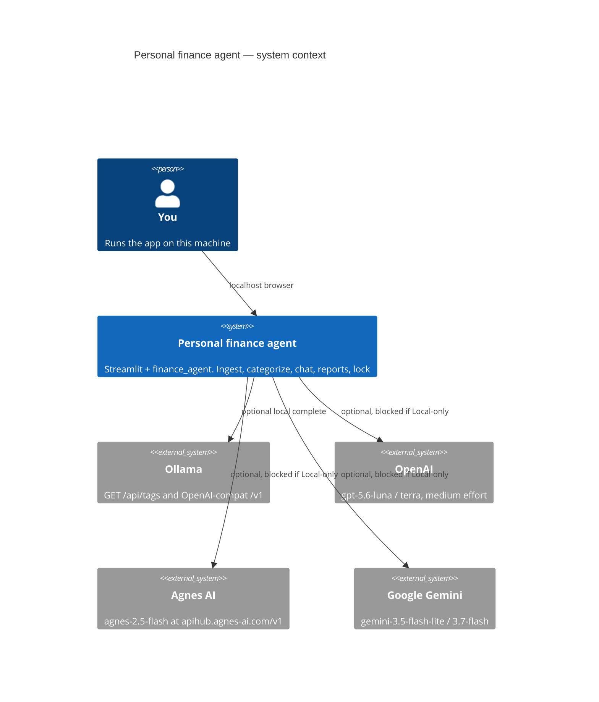
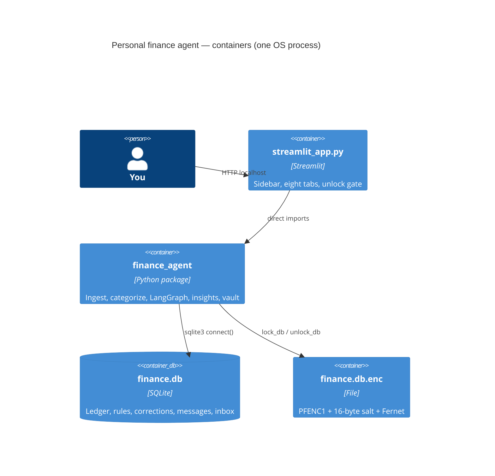
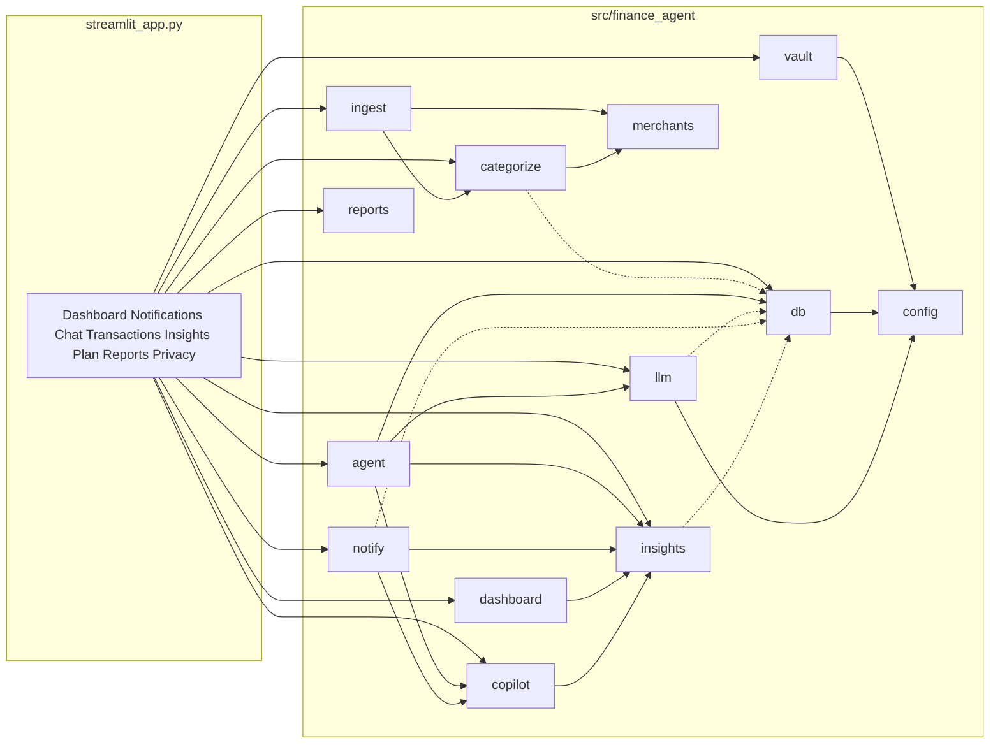
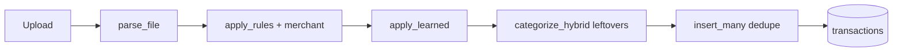
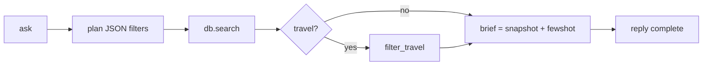
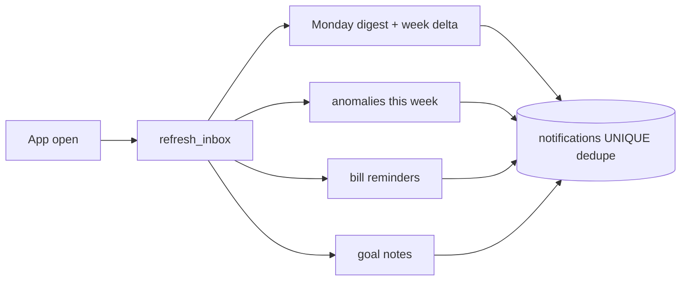

# Project Architecture Blueprint

**Project:** `finance-agent` 0.1.0 (Intelligent Personal Finance Agent)
**Generated:** 2026-08-16
**Source commit:** `0109ff3e0e60c2c8cbfb3017eb29a7c651dcf429` (`main`)
**Remote:** https://github.com/pypi-ahmad/intelligent-personal-finance-agent

This document is a consistency reference for the architecture that is **in the tree today**. Claims below come from `pyproject.toml`, `streamlit_app.py`, `src/finance_agent/*`, `tests/`, `run.cmd`, and `.streamlit/config.toml`. It is not a product roadmap.

**Stale label:** `pyproject.toml` description still says "Phase 1". Runtime `__init__.py` and `README.md` describe Phase 8. Trust the modules, not that one-line description.

**Related artifacts (not this blueprint):**
- `ARCHITECTURE.md`: local-first architecture snapshot
- `docs/technical.md` / `docs/how-to-use.md`: Diátaxis reference and how-to
- `docs/archify/finance-agent.html`: validated component diagram
- `graphify-out/graph.html`: knowledge graph

---

## 1. Architecture detection and analysis

### 1.1 Technology stack (detected)

| Layer | Choice | Evidence |
| --- | --- | --- |
| Language | Python `>=3.11` (Ruff/ty target `py311`) | `pyproject.toml` |
| Package layout | `src/` layout, package `finance_agent` | `src/finance_agent/` |
| UI | Streamlit `>=1.61.1`, Altair charts | `streamlit_app.py`, `.streamlit/config.toml` |
| Agent | LangGraph `StateGraph` plan → fetch → brief → reply | `agent.py` |
| LLM | `openai` (OpenAI, Agnes, Ollama `/v1`), `google-genai`, `httpx` for Ollama tags | `llm.py` |
| Parse | pandas, openpyxl, pypdf, Pillow | `ingest.py`, `pyproject.toml` |
| Store | `sqlite3` file `data/finance.db` | `config.py` `DB_PATH`, `db.py` |
| Crypto | `cryptography` Fernet + PBKDF2HMAC 200k | `vault.py` |
| Reports | fpdf2 | `reports.py` |
| Tooling | uv + `uv_build` + `uv.lock`, pytest, ruff (`select = ALL`), ty | `pyproject.toml` |
| Deploy | Local process. `run.cmd` → `uv sync --all-groups` → Streamlit `--server.address localhost` | `run.cmd` |
| CI / Docker / bank API | None | no `.github/workflows`, no Dockerfile |

### 1.2 Architectural pattern (detected)

**Single-process modular monolith** with **convention-only layers**.

Not Clean Architecture, not microservices, not hexagonal ports-and-adapters. There is no DI container, no interface package, no import linter.

Signals:
- One UI process (`streamlit_app.py`) imports a flat domain package (`src/finance_agent/`, 14 modules).
- Persistence is one SQLite file opened by `db.connect()`.
- LLM providers are a thin facade (`llm.complete`), not plugins.
- LangGraph is an **in-process** linear graph, not a worker or queue.
- Notifications run in `notify.refresh_inbox` on each app open, with no cron and no Windows service.

**Hybrid flavor:** pipeline style (ingest → categorize → store) plus a small LangGraph Q&A slice plus a Streamlit tab shell.

---

## 2. Architectural overview

### 2.1 Approach

A person runs Streamlit on localhost. They upload statements, fix categories, ask questions, and optionally lock the ledger. All durable state is `data/finance.db` (or `data/finance.db.enc` when locked). Cloud models are optional and can be hard-blocked.

```
upload → parse → merchant → learned/rules → hybrid LLM leftovers → SQLite
question → plan filters → search (+ travel) → brief → answer
open app → refresh_inbox (Monday digest if due)
```

### 2.2 Guiding principles (evident in code)

1. Local-first: default bind is localhost. Keys from OS env / HKCU, not committed `.env`.
2. Rules before models: user rules → corrections → builtins → local LLM → API leftovers.
3. CSV/Excel work without a model. PDF/images and leftover fill need one.
4. No hosted product API. No bank connection. Digests are on-open, not scheduled.
5. Passphrase is not stored. Vault writes `PFENC1` + salt + Fernet and deletes plaintext.
6. Logic lives in the package. `streamlit_app.py` is widgets + orchestration.

### 2.3 Boundaries and how they are enforced

| Boundary | Mechanism | Enforced? |
| --- | --- | --- |
| UI vs domain | Import convention: widgets in `streamlit_app.py`, logic in `src/finance_agent/` | Convention only |
| Local-only vs cloud | `db.is_local_only()` + `llm.complete` raises `PermissionError` unless provider is `Ollama` | Yes, in `complete()` |
| Locked vs unlocked ledger | `vault.is_locked()` → unlock form + `st.stop()` before other DB reads | Yes, at app start |
| Process vs OS env | `load_dotenv(override=False)` then `env()` (process, then Windows `HKCU\Environment`) | Yes |
| Dedupe | `insert_many` skips `(date, description, amount)` | Yes |
| Inbox spam | `notifications.dedupe` UNIQUE + `INSERT OR IGNORE` via `add_notification` | Yes |

Layering is **not** mechanically enforced. A new import from `db.py` into `streamlit_app.py` is allowed by the toolchain.

---

## 3. Architecture visualization (C4)

### 3.1 Level 1: system context



### 3.2 Level 2: containers



There is one process. "Containers" here are files and a package, not Docker.

### 3.3 Level 3: components



Dotted edges are **lazy imports** used to break import cycles (`categorize` ↔ `db`, `llm` → `db`, `insights.snapshot` → `db`).

### 3.4 Data / process flows

**Ingest**



**Chat**



**Inbox**



---

## 4. Core architectural components

### 4.1 `streamlit_app.py`: composition root / UI

| | |
| --- | --- |
| **Purpose** | Only process entry. Sidebar (Local-only, provider, model, upload). Eight tabs. Unlock gate. |
| **Scope** | Widgets, session state, wiring. Must not grow domain rules. |
| **Structure** | Module-level script. Helpers `_call`, `_hybrid_completes`, `_remember`, `_today`. |
| **Patterns** | Composition root. Unlock uses `st.stop()`. Session keys per provider (`model_{provider}`) so dropdowns do not collide. |
| **Talks to** | Almost every package module via direct import. |
| **Extend** | New tab + call into a new `src/finance_agent/` function. Do not put SQL in the tab. |

Tabs: Dashboard, Notifications, Chat, Transactions, Insights, Plan, Reports, Privacy.

### 4.2 `config.py`: constants and env

| | |
| --- | --- |
| **Purpose** | Paths (`ROOT`, `DATA_DIR`, `DB_PATH`), provider/model IDs, `CATEGORIES`, `ACCOUNT_KINDS`, `GOAL_KINDS`, `TRAVEL_NEEDLES`, `env()`. |
| **Scope** | No I/O except `load_dotenv(override=False)` and optional `winreg`. |
| **Extend** | New provider constant + `llm.models_for` / `missing_key`. New category string in `CATEGORIES` (UI and LLM prompts share this tuple). |

### 4.3 `llm.py`: provider facade

| | |
| --- | --- |
| **Purpose** | `complete`, `models_for`, `list_ollama_models`, `missing_key`. |
| **Structure** | OpenAI-compat path for OpenAI / Agnes / Ollama. Separate `_google` via `google.genai`. |
| **Patterns** | Facade. Local-only gate. One retry that drops `reasoning_effort` if OpenAI rejects it. Image MIME sniff (png/jpeg/webp). |
| **Extend** | Add a branch in `complete` / `models_for`. Do not call SDKs from the UI. |

### 4.4 `ingest.py`: statement parse

| | |
| --- | --- |
| **Purpose** | Bytes + filename → list of row dicts. |
| **Routing** | suffix: csv/tsv → pandas; xlsx/xls → openpyxl; pdf → LLM then loose text; images → LLM required. |
| **Patterns** | Strategy by suffix. Column alias pick (`_pick`). Shared `parse_json_payload` for fenced JSON (also used by agent plan). |
| **Limit** | No bank connectors. No password-PDF path. |

### 4.5 `merchants.py` + `categorize.py`: identity and category pipeline

| | |
| --- | --- |
| **Purpose** | Alias map (`ALIASES`) + `assign_category` order + hybrid leftover fill. |
| **Order** | user_rules needle → `corrections` map (merchant then `merchant_key`) → builtin `RULES` → `categorize_hybrid` (local complete, then API complete) on rows still `OTHER`. |
| **Patterns** | Chain of responsibility. Failures in LLM fill are `suppress`ed. |
| **Extend** | Add alias / builtin rule, or `upsert_user_rule` from Plan tab. |

### 4.6 `db.py`: persistence facade

| | |
| --- | --- |
| **Purpose** | Schema, migrate, CRUD, search, settings, export zip, wipe. |
| **Structure** | Module functions, not a repository class. `connect()` creates file, runs `SCHEMA`, `_migrate`. |
| **Patterns** | Table-module / transaction script. Context-manager connection (`with connect()`). |
| **Hot node** | `connect()` is the graph hub (every persistence call opens a new connection). |
| **Extend** | Add table to `SCHEMA` + `_migrate` ALTER if existing DBs must survive. Add functions next to existing ones. |

### 4.7 `agent.py`: LangGraph Q&A

| | |
| --- | --- |
| **Purpose** | `ask(question, provider, model, history)` → answer string. |
| **Structure** | `AgentState` TypedDict. Nodes `_plan` `_fetch` `_brief` `_reply`. `build_graph()` compiled once (`lru_cache`). |
| **History** | Last 8 messages only (`_history_text`). |
| **Extend** | Add a node only if the linear plan-fetch-brief-reply path is insufficient. Prefer richer filters in `_plan` first. |

### 4.8 `insights.py` / `copilot.py` / `dashboard.py`: pure-ish analytics

| | |
| --- | --- |
| **Purpose** | Series, MAD anomaly fence, budgets, travel window, recurring, net worth, forecast, inflation, cancel list. |
| **Pattern** | Functions over `list[dict]`. `insights.snapshot()` is the exception: it reads the DB. |
| **Extend** | New series function + Dashboard/Insights tab. Keep it free of Streamlit. |

### 4.9 `notify.py`: on-open inbox

| | |
| --- | --- |
| **Purpose** | `refresh_inbox(today)` writes digest, week-change, anomalies, bills, goal notes. |
| **Pattern** | Idempotent writes via `dedupe` keys (`digest-YYYY-MM-DD`, `anomaly-…`). |
| **Limit** | Not a scheduler. Monday digest is inserted when the app is opened on/after that Monday. |

### 4.10 `reports.py`: documents

Month / week / tax-year Markdown and PDF (`fpdf2`). ASCII wrapping for PDF width. No template engine.

### 4.11 `vault.py`: at-rest lock

`PFENC1` + 16-byte salt + Fernet. PBKDF2-HMAC-SHA256, 200_000 rounds. `lock_db` writes `.enc` and unlinks plaintext. `unlock_db` reverses. Passphrase never stored.

---

## 5. Architectural layers and dependencies

### 5.1 Layers as implemented

| Layer | Modules | Allowed to depend on |
| --- | --- | --- |
| Presentation | `streamlit_app.py` | All package modules |
| Application | `agent.py`, `notify.py` | domain + llm + db |
| Domain / policy | `categorize.py`, `merchants.py`, `copilot.py`, `insights.py`, `dashboard.py`, `ingest.py`, `reports.py` | `config`, each other (careful), lazy `db` |
| Infrastructure | `db.py`, `llm.py`, `vault.py`, `config.py` | `config`, stdlib, vendor SDKs |

**Intended rule:** presentation → application → domain → infrastructure. **Actual rule:** anyone may import `db` or `llm`. Cycles are avoided with **function-local imports**, not interfaces.

### 5.2 Known lazy-import cycle breaks

| Caller | Local import | Why |
| --- | --- | --- |
| `categorize.apply_learned` | `db.latest_correction_map`, `list_user_rules` | categorize used by ingest before db is always wanted |
| `categorize.categorize_with_llm` | `ingest.parse_json_payload` | ingest already imports `apply_rules` |
| `llm.complete` | `db.is_local_only` | llm must not import db at module load |
| `agent._brief` | `db.list_fewshot` | keep graph module light |
| `insights.snapshot` | `db.list_*` | rest of insights is pure |
| `notify.refresh_inbox` | `db.*` | notify imported by UI early |

### 5.3 Dependency injection

None. Callables (`complete`, `local_complete`, `api_complete`, `llm_extract`) are passed as arguments where tests need seams. That is the only injection.

### 5.4 Circular / layer notes

- `ingest` → `categorize.apply_rules` (module level) and `categorize` → `ingest.parse_json_payload` (lazy): stable, do not invert.
- `streamlit_app` is a wide client of `db`. Acceptable for a small monolith; do not add a second UI that copies those queries, add functions on `db.py` instead.

---

## 6. Data architecture

### 6.1 Physical store

One SQLite file: `data/finance.db` (`config.DB_PATH`). Created on first `connect()`. Gitignored.

Optional lock file: `data/finance.db.enc`. When locked, plaintext is absent.

Default currency: `INR`. Spend is `amount < 0`.

### 6.2 Tables

| Table | Grain | Notes |
| --- | --- | --- |
| `transactions` | one ledger row | `merchant`, `parent_id` (splits). Indexes on `date`, `category`. |
| `budgets` | category × `YYYY-MM` | Composite PK |
| `accounts` | name | `kind` in `asset` / `liability` |
| `goals` | one goal | `kind` in `savings` / `debt` |
| `messages` | chat turn | loaded into `st.session_state` once |
| `settings` | key/value | `local_only` |
| `user_rules` | needle → category | unique needle |
| `corrections` | learned merchant → category | latest wins via `latest_correction_map` |
| `notifications` | inbox row | unique `dedupe` |

`_migrate` adds `merchant` / `parent_id` if an older file lacks them.

### 6.3 In-memory row shape

Ingest and analytics use plain `dict`s, not ORM entities:

`date`, `description`, `amount`, `currency`, `category`, `source_file`, `account`, `merchant`, `parent_id`.

### 6.4 Access patterns

- No repository class: `db.py` is the mapper.
- **Search:** `db.search(...)` optional filters (dates, category, text, account).
- **Dedupe:** exact `(date, description, amount)`.
- **Splits:** delete original conceptually via `split_transaction`; children carry `parent_id`; descriptions include `(split)`.
- **Corrections:** `update_category` → `record_correction`.
- **Export:** `export_snapshot` + `export_zip` → `data.json` + `transactions.csv`.
- **Cache:** none. Charts recompute from `list_transactions(500)` (cap is a real limit).
- **Validation:** category must be in `CATEGORIES`; split parts must sum within `SPLIT_TOL` (0.02); passphrase non-empty.

### 6.5 Relationships (logical)

```
accounts.name  ←—— transactions.account   (string, not FK)
transactions.id ←—— transactions.parent_id (split children)
corrections.merchant matches merchants.normalize_merchant / merchant_key
user_rules.needle ⊂ description.lower()
notifications.dedupe is an application-generated idempotency key
```

SQLite FKs are **not** declared.

---

## 7. Cross-cutting concerns

### 7.1 Authentication and authorization

There is **no user account system**. Trust boundary is the OS user on the machine.

| Control | Where |
| --- | --- |
| Bind localhost | `run.cmd` `--server.address localhost` |
| Local-only | `settings.local_only` + `PermissionError` in `complete()` |
| Vault | passphrase → Fernet; wrong phrase → `ValueError("Wrong passphrase")` |
| Streamlit usage stats off | `.streamlit/config.toml` `gatherUsageStats = false` |

Not present: OAuth, RBAC, multi-tenant isolation.

### 7.2 Error handling and resilience

| Pattern | Where |
| --- | --- |
| `ValueError` for user-fixable input | vault, ingest image-without-model, unknown provider |
| `PermissionError` for policy | local-only cloud call |
| `suppress` around leftover LLM | `categorize_hybrid`: leftover stays `OTHER` |
| OpenAI extra-arg fallback | retry without `reasoning_effort` |
| Ollama tags fail soft | `list_ollama_models` → `[]` on `HTTPError` |
| Agent plan JSON fail | empty dict → `infer_range` / `wants_travel` heuristics |
| UI | `st.session_state.last_error`, `st.error` |

No circuit breaker, no retry/backoff library, no Sentry.

### 7.3 Logging and monitoring

No structured logger, metrics, or tracing. Failures surface as Streamlit errors or empty model lists.

### 7.4 Validation

- Categories: membership in `CATEGORIES`.
- Providers: `PROVIDERS` / local-only subset.
- Amounts: parsed in ingest; split sum check in `split_transaction`.
- LLM JSON: `parse_json_payload` + type checks; invalid items dropped.

### 7.5 Configuration and secrets

| Source | Role |
| --- | --- |
| Process env | wins (`load_dotenv(override=False)`) |
| Windows `HKCU\Environment` | `env()` fallback if process empty |
| `.env` | fill-in only; gitignored |
| `.env.example` | template |
| `settings` table | `local_only` feature flag |
| Hardcoded | Agnes base URL, model ID lists, `OPENAI_EFFORT = "medium"` |

Keys: `OPENAI_API_KEY`, `OPENAI_BASE_URL`, `AGNES_API_KEY`, `GOOGLE_API_KEY`, `OLLAMA_HOST`.

---

## 8. Service communication patterns

This is **not** a service mesh.

| Hop | Protocol | Sync? |
| --- | --- | --- |
| Browser → Streamlit | HTTP localhost | Sync request / rerun |
| UI → package | in-process Python call | Sync |
| Package → SQLite | `sqlite3` | Sync, short connections |
| `complete` → Ollama | OpenAI-compat HTTP `/v1` | Sync |
| `list_ollama_models` | `GET {OLLAMA_HOST}/api/tags` timeout 2s | Sync |
| `complete` → OpenAI / Agnes | `openai` SDK | Sync |
| `complete` → Google | `google.genai` | Sync |

No API versioning, no service discovery, no message bus. Cloud calls are **optional outbound** only.

---

## 9. Technology-specific patterns

### 9.1 Python

- Modules, not classes: domain is functions + dicts. Exceptions: `AgentState` TypedDict, LangGraph compiled graph.
- `src/` layout via `uv_build`.
- Lazy imports instead of interfaces to cut cycles.
- Sync only: no `asyncio` in the package.
- Typing: `from __future__ import annotations`; Ruff `ANN` ignored.

### 9.2 Streamlit

- Script rerun model: every widget change re-executes the file.
- Unlock **before** `list_messages` / tabs.
- `st.session_state` for chat; persisted copy in `messages` table.
- Theme: `[theme]`, `[theme.light]`, `[theme.dark]` in `.streamlit/config.toml`.
- Dashboard uses Altair; landing tab is Dashboard.

### 9.3 LangGraph

- Linear `StateGraph`, four nodes, no conditional edges.
- Two LLM calls per question (plan + reply) plus deterministic fetch/brief.
- Graph object cached with `lru_cache(maxsize=1)`.

### 9.4 SQLite

- `CREATE TABLE IF NOT EXISTS` on every connect.
- Additive `_migrate` only (ALTER ADD COLUMN).
- `row_factory = sqlite3.Row` then `dict(row)`.

### 9.5 Stacks not present

No .NET, Java, React, Angular, Node service, Flutter. Skip those templates.

---

## 10. Implementation patterns

### 10.1 Interfaces

There are no ABCs. Seams are **callables**:

- `complete(provider, model, prompt, *, system=None, image=None) -> str`
- Hybrid: `local_complete(prompt) -> str` and `api_complete(prompt) -> str`
- Ingest vision: `llm_extract(prompt, image=bytes|None)`

Tests inject fakes / `monkeypatch`.

### 10.2 "Services"

Module-level functions. Lifetime = process. No singleton container. `build_graph()` is the only cached object.

### 10.3 Persistence

Open, use, close per function (`with connect()`). No connection pool. Fine for single-user localhost; do not assume concurrent writers.

`insert_many` is row-at-a-time existence check + insert (not a bulk UPSERT).

### 10.4 "Controllers"

Streamlit callbacks and `if ingest:` / `if st.button` blocks. Responses are `st.dataframe`, `st.altair_chart`, `st.download_button`, `st.chat_message`.

### 10.5 Domain model

- Categories are uppercase strings from a closed tuple.
- Merchant is a normalized display string; `merchant_key` is a fallback identity.
- Anomaly fence is MAD-based (`insights._fence`), not IQR (IQR was contaminated by outliers in earlier code).

---

## 11. Testing architecture

| Layer | How | Files |
| --- | --- | --- |
| Unit (pure functions) | Direct calls, no DB | most of `test_phase2`, `test_phase5`, parts of 3/4/6 |
| Persistence | `tmp_path` + `monkeypatch` `DB_PATH` / `DATA_DIR` | `test_phase1` insert, `test_phase3` wipe, `test_phase4` learn/split, `test_phase6` inbox, `test_phase8` vault/export |
| LLM seams | inject lambdas / monkeypatch `complete` | hybrid local-then-api, local-only block |
| UI / e2e | **none** | no Streamlit AppTest |

**Runner:** `uv run pytest` (35 tests last documented run). No coverage floor.

**Doubles:** function stubs, not unittest.mock-heavy fakes. `monkeypatch` for paths and env.

**Gap:** no `test_phase7` (phase skipped). No browser tests. PDF tests assert content, not layout.

Ruff test ignores: `S101` (assert), `PLR2004` (magic values).

---

## 12. Deployment architecture

| Fact | Detail |
| --- | --- |
| Topology | One Windows (or any) machine, one Streamlit process |
| Entry | Double-click `run.cmd` or `uv run streamlit run streamlit_app.py --server.address localhost` |
| Install | `uv sync --all-groups` (runtime + pytest/ruff/ty) |
| Runtime deps | Resolved from `uv.lock` |
| Environments | No staging/prod split. `.env` is optional local fill-in |
| Containers / k8s / cloud host | Not used |
| Cloud services | Outbound LLM only; app does not deploy there |
| Locked mode | If `.enc` exists and `.db` does not, UI is unlock-only |

`.python-version` may be 3.14 while tools target 3.11, so run tests with the project env (`uv run`).

---

## 13. Extension and evolution

### 13.1 Add a feature (default path)

1. Put logic in `src/finance_agent/<module>.py` (new file if the concern is new).
2. Persist in `db.py` (`SCHEMA` + `_migrate` + functions) if it must survive restart.
3. Wire a widget in `streamlit_app.py` only.
4. Add `tests/test_*.py` (prefer a new phase file only for a large slice).
5. `uv run pytest` and `uv run ruff check`.

### 13.2 Where new code goes

| Kind | Place |
| --- | --- |
| New chart / series | `dashboard.py` or `insights.py` |
| New inbox kind | `notify.py` + `add_notification` dedupe key |
| New parse format | branch in `parse_file` |
| New merchant alias | `merchants.ALIASES` |
| New builtin category heuristic | `categorize.RULES` |
| New user-facing rule | Plan tab → `upsert_user_rule` (already) |
| New LLM provider | `config` + `llm.models_for` / `missing_key` / `complete` |
| New setting | `settings` key via `get_setting` / `set_setting` |

### 13.3 Modify safely

- Additive SQLite columns only (follow `_migrate`).
- Keep `CATEGORIES` closed or update prompts + UI selectboxes together.
- Do not store the vault passphrase.
- Do not copy `.env` in `run.cmd` (empty file would hide OS keys if `override` were true; current code uses `override=False` and does not copy).

### 13.4 Integrate an external system

There is no anti-corruption layer package. If you add a bank/API:

- New module `src/finance_agent/<vendor>.py` that **emits the same row dicts** as `parse_file`.
- Call `apply_learned` + `insert_many`; do not write SQL in the vendor module.
- Keep it behind Local-only if it leaves the machine.
- Do not put tokens in the repo.

This would be a new architectural decision; do not pretend adapters exist today.

### 13.5 Known product gaps (not implemented)

Receipt OCR + attach, password PDFs, Indian-bank-specific parsers, hypotheticals, citation of source txs in answers. Do not document them as extension points that already exist.

---

## 14. Architectural pattern examples

### 14.1 Local-only gate (policy at the infrastructure edge)

```python
# llm.py — complete()
from finance_agent.db import is_local_only

if is_local_only() and provider != "Ollama":
    msg = "Local-first mode blocks cloud providers."
    raise PermissionError(msg)
```

The UI also hides non-Ollama providers, but **the gate is in `complete()`**, so categorize/chat cannot bypass it.

### 14.2 Category chain of responsibility

```python
# categorize.assign_category
for rule in user_rules or []:
    if needle and needle in text and cat in CATEGORIES:
        return cat, merchant
if correction_map:
    if merchant and merchant in correction_map:
        return correction_map[merchant], merchant
    if key in correction_map:
        return correction_map[key], merchant
return apply_rules(description), merchant
```

### 14.3 LangGraph linear pipeline

```python
graph.add_edge(START, "plan")
graph.add_edge("plan", "fetch")
graph.add_edge("fetch", "brief")
graph.add_edge("brief", "reply")
graph.add_edge("reply", END)
```

No routers. Travel is a filter flag, not a graph branch.

### 14.4 Unlock composition root

```python
if is_locked():
    # unlock form …
    st.stop()
```

Everything after this line may assume a plaintext `finance.db`.

### 14.5 Hybrid leftover fill (two optional callables)

```python
if local_complete:
    with suppress(ValueError, TypeError, OSError, RuntimeError):
        categorize_with_llm(rows, local_complete, examples=examples)
if api_complete:
    with suppress(ValueError, TypeError, OSError, RuntimeError):
        categorize_with_llm(rows, api_complete, examples=examples)
```

UI builds those callables in `_hybrid_completes` (Ollama first, then selected cloud if allowed).

---

## 15. Architectural decision records (inferred from the code)

These are **reconstructed** from the implementation. There is no `docs/adr/` folder.

### ADR-1: single-process modular monolith

- **Context:** Personal ledger, one user, Windows-first.
- **Decision:** Streamlit script + flat Python package + SQLite file.
- **Not chosen:** FastAPI + SPA, multi-service, hosted SaaS.
- **Consequence:** Fast to change; no horizontal scale; UI and domain share a process. Layering is social.

### ADR-2: LangGraph only for Q&A

- **Context:** Need structured retrieve-then-answer, not a free-form agent loop.
- **Decision:** Four-node linear graph; ingest/categorize stay imperative.
- **Consequence:** Two model calls per question. Easy to test `_plan` JSON failure path. Not a general tool-calling agent.

### ADR-3: hybrid categorize, rules first

- **Context:** LLM leftover fill is expensive and flaky; users correct merchants.
- **Decision:** user rules → corrections → builtins → local few-shot → API leftovers.
- **Consequence:** CSV works offline. Leftovers can stay `OTHER`. Learning is merchant-scoped, not embedding-based.

### ADR-4: env wins over `.env`

- **Context:** An older `run.cmd` could create an empty `.env` that hid OS keys if loaded with override.
- **Decision:** `load_dotenv(override=False)`; `env()` reads process then HKCU; `run.cmd` does not copy `.env`.
- **Consequence:** Same machine keys keep working. New machines still need `.env.example` → `.env`.

### ADR-5: on-open notifications, not cron

- **Context:** No desire to install a Windows service.
- **Decision:** `refresh_inbox` at the top of the Streamlit script; UNIQUE `dedupe`.
- **Consequence:** No digest if the app is never opened. Idempotent if opened often.

### ADR-6: optional Fernet file lock

- **Context:** Ledger is local and sensitive; full disk encryption is the user's OS problem.
- **Decision:** Whole-file encrypt with `PFENC1` header; delete plaintext on lock.
- **Consequence:** No row-level encryption. Forgot passphrase = data gone. App cannot read DB while locked.

### ADR-7: OpenAI-compat for three providers

- **Context:** Ollama, OpenAI, Agnes all speak chat completions.
- **Decision:** One `_openai_compat` path; Google stays on `google.genai`.
- **Consequence:** Agnes base URL is hardcoded. OpenAI `reasoning_effort=medium` may be stripped on retry.

### ADR-8: dict rows over ORM

- **Context:** Small schema, pandas ingest, Streamlit `data_editor`.
- **Decision:** `sqlite3` + dicts.
- **Consequence:** No unit of work. Easy tests. Easy to drift column lists (`list_transactions` historically omitted `parent_id` in some SELECTs; check SQL when adding columns).

---

## 16. Architecture governance

| Control | Status |
| --- | --- |
| Ruff `select = ALL` (with documented ignores) | Yes: style/safety, not layers |
| ty (type checker) target 3.11 | Yes |
| pytest | Yes, 7 files, no coverage gate |
| Import linter / layer check | **No** |
| CI | **No** |
| ADR folder | **No** (this blueprint + `ARCHITECTURE.md`) |
| Review process | Informal; public GitHub `main` |

**Docs to keep aligned when architecture changes:** `ARCHITECTURE.md`, `docs/technical.md`, `README.md`, this file, `docs/archify/*.json` if the component map changes.

**Do not treat** `graphify-out/` or `.ua/` as governance. They are analysis outputs.

---

## 17. Blueprint for new development

### 17.1 Workflow by feature type

| Feature | Start | Then | Test |
| --- | --- | --- | --- |
| New metric / chart | `insights.py` or `dashboard.py` | Dashboard or Insights tab | `test_phase5`-style pure rows |
| New inbox event | Compute in `notify.py` | `add_notification(kind, dedupe, …)` | `test_refresh_inbox_dedupes` pattern |
| New parse format | `parse_file` branch | reuse `apply_learned` | bytes fixture like `test_csv_debit_credit` |
| Learn-from-user | already `update_category` | do not invent a second corrections table | `test_learn_and_split` |
| New provider | `config` + `llm` | sidebar already loops `PROVIDERS` | `test_provider_models` + local-only test |
| New setting | `get_setting` / `set_setting` | Privacy or sidebar toggle | persist via tmp DB |
| New report | `reports.py` | Reports tab download | `test_tax_report_lists_year` style |

### 17.2 File template (new domain module)

```
src/finance_agent/<name>.py
  - module docstring (one line, what not why-the-phase)
  - functions, dict in / dict out
  - import config; lazy-import db if needed
  - no streamlit

tests/test_<name>.py
  - tmp_path + monkeypatch DB_PATH if you touch SQLite
```

Do not add `services/`, `repositories/`, or `interfaces/` folders unless the package actually grows a second process.

### 17.3 Common pitfalls

1. **SQL in `streamlit_app.py`.** Goes stale; put it in `db.py`.
2. **Calling OpenAI/Google without `complete()`.** Bypasses Local-only.
3. **Shared Streamlit widget `key="model"`.** Breaks provider switches; key by provider.
4. **Assuming `list_transactions(500)` is the full ledger.** It is capped.
5. **IQR for anomalies.** Use the MAD fence already in `insights._fence`.
6. **Creating empty `.env` in launch scripts.**
7. **Storing the vault passphrase.**
8. **New table without `_migrate`.** Fresh DBs get `SCHEMA`; existing user DBs do not.
9. **Reversing `calls` / category order** (LLM before user rules).
10. **Launching Streamlit as the only test.** There is a standing 5-minute cap for app-launch checks; prefer pytest.

### 17.4 Keeping this blueprint current

Regenerate or edit this file when any of these change:

- New module under `src/finance_agent/`
- New SQLite table or `complete()` provider
- New process (API server, worker, cron)
- Layer enforcement tooling (import-linter, CI)

Suggested cadence: same commit as the structural change, not a separate "docs later" pass.

---

*End of blueprint. Implementation-ready for this repo's current shape: a local Streamlit monolith, not a distributed system.*
